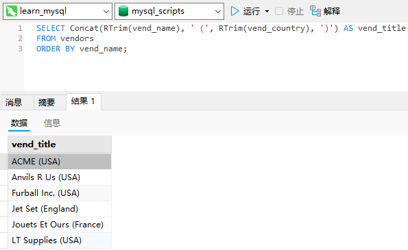
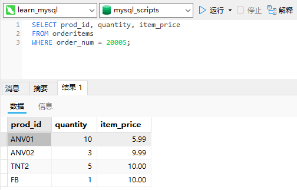
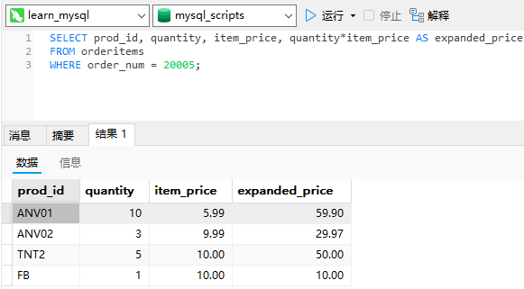
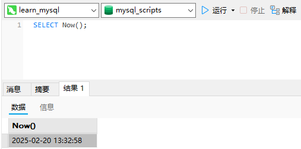

# 10_创建计算字段

## 计算字段

存储在数据库表中的数据一般不是应用程序所需要的格式。

字段（field）：基本上与列（column）的意思相同，经常互换使用，不过数据库列一般称为列，而术语字段通常用在计算字段的连接上。

## 拼接字段

`vendors`表包含供应商名和位置信息。假如要生成一个供应商报表，需要在供应商的名字中按照`name(location)`这样的格式列出供应商的位置。此报表需要单个值，而表中数据存储在两个列`vend_name`和`vend_country`中。此外，需要用括号将`vend_country`括起来，这些东西都没有明确存储在数据库表中。我们来看看怎样编写返回供应商名和位置的SELECT语句。

拼接（concatenate）：将值联结到一起构成单个值。

解决办法是把两个列拼接起来。在MySQL的`SELECT`语句中，可使用`Concat()`函数来拼接两个列。

```sql
SELECT Concat(vend_name, ' (', vend_country, ')')
FROM vendors
ORDER BY vend_name;
```


`Concat()`拼接串，即把多个串连接起来形成一个较长的串。
`Concat()`需要一个或多个指定的串，各个串之间用逗号分隔。
上面的`SELECT`语句连接以下4个元素：
存储在`vend_name`列中的名字；
包含一个空格和一个左圆括号的串；
存储在`vend_country`列中的国家；
包含一个右圆括号的串。
从上述输出中可以看到，`SELECT`语句返回包含上述4个元素的单个列（计算字段）。

用MySQL的`RTrim()`函数来完成通过删除数据右侧多余的空格来整理数据。

```sql
SELECT Concat(Trim(vend_name), ' (', Trim(vend_country), ')')
FROM vendors
ORDER BY vend_name;
```


`Trim`函数：MySQL除了支持`RTrim()`（去掉串右边的空格），还支持`LTrim()`（去掉串左边的空格）以及`Trim()`（去掉串左右两边的空格）。

### 使用别名

别名（alias）是一个字段或值的替换名。别名用`AS`关键字赋予。

```sql
SELECT Concat(RTrim(vend_name), ' (', RTrim(vend_country), ')') AS
vend_title
FROM vendors
ORDER BY vend_name;
```



`SELECT`语句本身与以前使用的相同，只不过这里的语句中计算字段之后跟了文本`AS vend_title`。它指示SQL创建一个包含指定计算的名为`vend_title`的计算字段。从输出中可以看到，结果与以前的相同，但现在列名为`vend_title`，任何客户机应用都可以按名引用这个列，就像它是一个实际的表列一样。

别名的其他用途：别名还有其他用途。常见的用途包括在实际的表列名包含不符合规定的字符（如空格）时重新命名它，在原来的名字含混或容易误解时扩充它，等等。

导出列：别名有时也称为导出列（derivedcolumn）。

## 执行算术计算

`orders`表包含收到的所有订单，`orderitems`表包含每个订单中的各项物品。下面的SQL语句检索订单号20005中的所有物品：

```sql
SELECT prod_id, quantity, item_price
FROM orderitems
WHERE order_num = 20005;
```



`item_price`列包含订单中每项物品的单价。如下汇总物品的价格（单价乘以订购数量）：

```sql
SELECT prod_id, quantity, item_price, quantity*item_price AS expanded_price
FROM orderitems
WHERE order_num = 20005;
```



输出中显示的`expanded_price`列为一个计算字段，此计算为`quantity*item_price`。客户机应用现在可以使用这个新计算列，就像使用其他列一样。

MySQL算术操作符

| 操作符 | 说明 |
| :----: | :--: |
|   +    |  加  |
|   -    |  减  |
|   *    |  乘  |
|   /    |  除  |

如何测试计算：`SELECT`提供了测试和试验函数与计算的一个很好的办法。虽然`SELECT`通常用来从表中检索数据，但可以省略`FROM`子句以便简单地访问和处理表达式。例如，`SELECT 3*2`;将返回`6`，`SELECT Trim('abc')`;将返回`abc`，而`SELECT Now()`利用`Now()`函数返回当前日期和时间。通过这些例子，可以明白如何根据需要使用SELECT进行试验。


