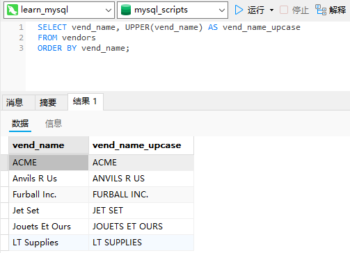
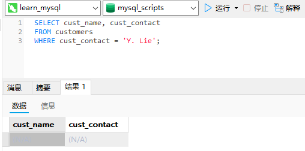
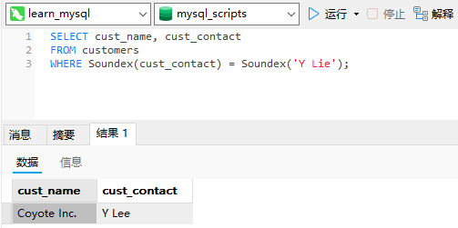
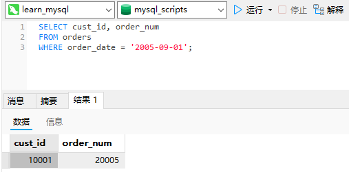
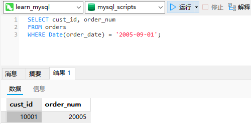
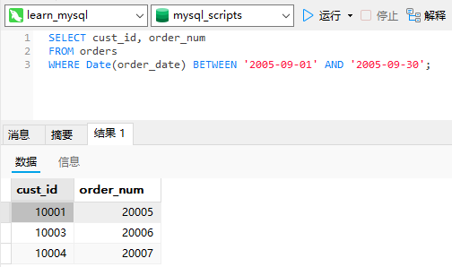
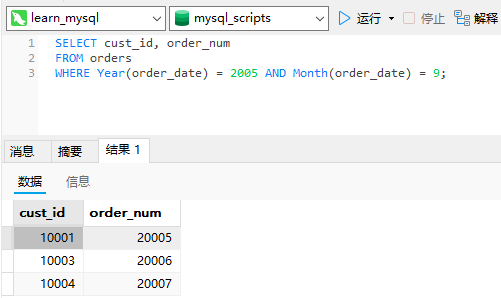
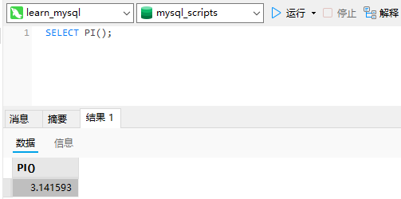

# 11_使用数据处理函数

## 函数

SQL支持利用函数来处理数据。

能运行在多个系统上的代码称为可移植的（portable）。

## 使用函数

大多数SQL实现支持以下类型的函数。

- 用于处理文本串（如删除或填充值，转换值为大写或小写）的文本函数。

- 用于在数值数据上进行算术操作（如返回绝对值，进行代数运算）的数值函数。

- 用于处理日期和时间值并从这些值中提取特定成分（例如，返回两个日期之差，检查日期有效性等）的日期和时间函数。

- 返回DBMS正使用的特殊信息（如返回用户登录信息，检查版本细节）的系统函数。

### 文本处理函数

使用`Upper()函数`：

```sql
SELECT vend_name, UPPER(vend_name) AS vend_name_upcase
FROM vendors
ORDER BY vend_name;
```



`Upper()`将文本转换为大写，因此本例子中每个供应商都列出两次，第一次为`vendors`表中存储的值，第二次作为列`vend_name_upcase`转换为大写。

常用文本处理函数：

|     函数      |        说明         |
| :-----------: | :-----------------: |
|   `Left()`    |  返回串左边的字符   |
|  `Length()`   |    返回串的长度     |
|  `Locate()`   |  找出串的一个子串   |
|   `Lower()`   |   将串转换为小写    |
|   `LTrim()`   |  去掉串左边的空格   |
|   `Right()`   |  返回串右边的字符   |
|   `RTrim()`   |  去掉串右边的空格   |
|  `Soundex()`  | 返回串的`SOUNDEX`值 |
| `SubString()` |   返回子串的字符    |
|   `Upper()`   |   将串转换为大写    |

`SOUNDEX`是一个将任何文本串转换为描述其语音表示的字母数字模式的算法。`SOUNDEX`考虑了类似的发音字符和音节，使得能对串进行发音比较而不是字母比较。

`customers`表中有一个顾客`Coyote Inc.`，其联系名为`Y.Lee`。但如果这是输入错误，此联系名实际应该是`Y.Lie`，怎么办？显然，按正确的联系名搜索不会返回数据，如下所示：

```sql
SELECT cust_name, cust_contact
FROM customers
WHERE cust_contact = 'Y. Lie';
```



现在试一下使用`Soundex()`函数进行搜索，它匹配所有发音类似于`Y.Lie`的联系名：

```sql
SELECT cust_name, cust_contact
FROM customers
WHERE Soundex(cust_contact) = Soundex('Y Lie');
```



在这个例子中，`WHERE`子句使用`Soundex()`函数来转换`cust_contact`列值和搜索串为它们的`SOUNDEX`值。因为`Y.Lee`和`Y.Lie`发音相似，所以它们的`SOUNDEX`值匹配，因此`WHERE`子句正确地过滤出了所需的数据。

### 日期和时间处理函数

常用日期和时间处理函数：

|      函数       |              说明              |
| :-------------: | :----------------------------: |
|   `AddDate()`   |    增加一个日期（天、周等）    |
|   `AddTime()`   |    增加一个时间（时、分等）    |
|   `CurDate()`   |          返回当前日期          |
|   `CurTime()`   |          返回当前时间          |
|    `Date()`     |     返回日期时间的日期部分     |
|  `DateDiff()`   |        计算两个日期之差        |
|  `Date_Add()`   |     高度灵活的日期运算函数     |
| `Date_Format()` |  返回一个格式化的日期或时间串  |
|     `Day()`     |     返回一个日期的天数部分     |
|  `DayOfWeek()`  | 对于一个日期，返回对应的星期几 |
|    `Hour()`     |     返回一个时间的小时部分     |
|   `Minute()`    |     返回一个时间的分钟部分     |
|    `Month()`    |     返回一个日期的月份部分     |
|     `Now()`     |       返回当前日期和时间       |
|   `Second()`    |      返回一个时间的秒部分      |
|    `Time()`     |   返回一个日期时间的时间部分   |
|    `Year()`     |     返回一个日期的年份部分     |

无论你什么时候指定一个日期，不管是插入或更新表值还是用`WHERE`子句进行过滤，日期必须为格式`yyyy-mm-dd`。

```sql
SELECT cust_id, order_num
FROM orders
WHERE order_date = '2005-09-01';
```



使用`WHERE order_date = '2005-09-01'`可靠吗？`order_date`的数据类型为`datetime`。这种类型存储日期及时间值。样例表中的值全都具有时间值`00:00:00`，但实际中很可能并不总是这样。如果用当前日期和时间存储订单日期（因此你不仅知道订单日期，还知道下订单当天的时间），怎么办？比如，存储的`order_date`值为`2005-09-0111:30:05`，则`WHERE order_date ='2005-09-01'`失败。即使给出具有该日期的一行，也不会把它检索出来，因为`WHERE`匹配失败。

解决办法是指示MySQL仅将给出的日期与列中的日期部分进行比较，而不是将给出的日期与整个列值进行比较。为此，必须使用`Date()`函数。`Date(order_date)`指示MySQL仅提取列的日期部分，更可靠的`SELECT`语句为：

```sql
SELECT cust_id, order_num
FROM orders
WHERE Date(order_date) = '2005-09-01';
```



如果要的是日期，请使用`Date()`：如果你想要的仅是日期，则使用`Date()`是一个良好的习惯，即使你知道相应的列只包含日期也是如此。这样，如果由于某种原因表中以后有日期和时间值，你的SQL代码也不用改变。当然，也存在一个`Time()`函数，在你只想要时间时应该使用它。

如果你想检索出2005年9月下的所有订单，怎么办？简单的相等测试不行，因为它也要匹配月份中的天数。有几种解决办法，其中之一如下所示：

```sql
SELECT cust_id, order_num
FROM orders
WHERE Date(order_date) BETWEEN '2005-09-01' AND '2005-09-30';
```



其中，`BETWEEN`操作符用来把`2005-09-01`和`2005-09-30`定义为一个要匹配的日期范围。

还有另外一种办法（一种不需要记住每个月中有多少天或不需要操心闰年2月的办法）：

```sql
SELECT cust_id, order_num
FROM orders
WHERE Year(order_date) = 2005 AND Month(order_date) = 9;
```



`Year()`是一个从日期（或日期时间）中返回年份的函数。类似，`Month()`从日期中返回月份。因此，`WHERE Year(order_date) = 2005 AND Month(order_date) = 9`检索出`order_date`为2005年9月的所有行。

### 数值处理函数

常用数值处理函数：

|   函数   |        说明        |
| :------: | :----------------: |
| `Abs()`  | 返回一个数的绝对值 |
| `Cos()`  | 返回一个角度的余弦 |
| `Exp()`  | 返回一个数的指数值 |
| `Mod()`  |  返回除操作的余数  |
|  `Pi()`  |     返回圆周率     |
| `Rand()` |   返回一个随机数   |
| `Sin()`  | 返回一个角度的正弦 |
| `Sqrt()` | 返回一个数的平方根 |
| `Tan()`  | 返回一个角度的正切 |

```sql
SELECT PI();
```

