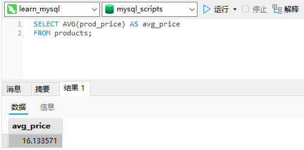
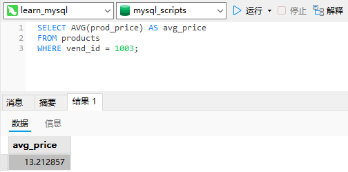
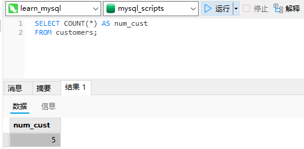
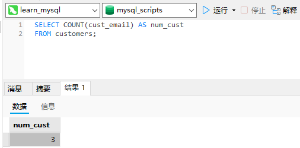
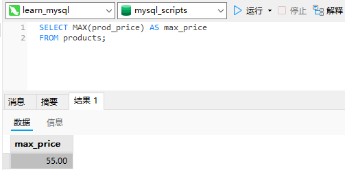
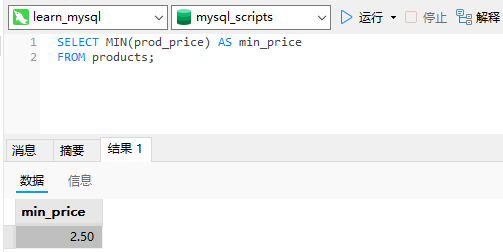
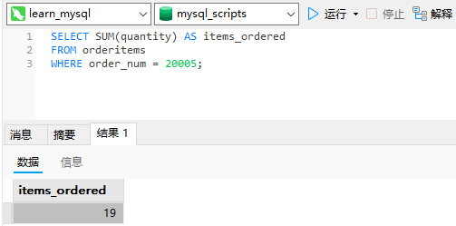
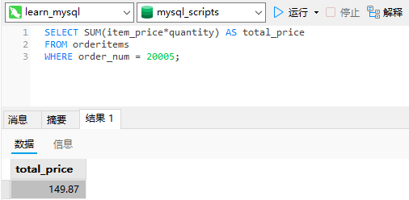
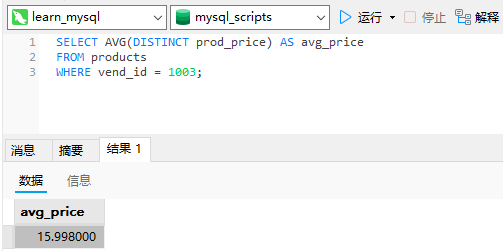
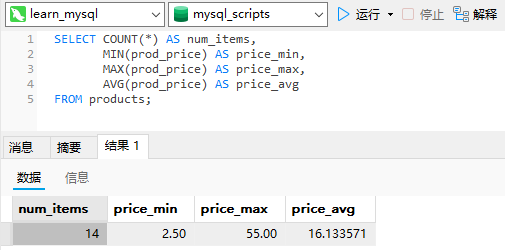

# 12_汇总数据

## 聚集函数

我们经常需要汇总数据而不用把它们实际检索出来，为此MySQL提供了专门的函数。使用这些函数，MySQL查询可用于检索数据，以便分析和报表生成。这种类型的检索例子有以下几种。

- 确定表中行数（或者满足某个条件或包含某个特定值的行数）。

- 获得表中行组的和。

- 找出表列（或所有行或某些特定的行）的最大值、最小值和平均值。

上述例子都需要对表中数据（而不是实际数据本身）汇总。

聚集函数（aggregate function）：运行在行组上，计算和返回单个值的函数。

SQL聚集函数：

|   函数    |       说明       |
| :-------: | :--------------: |
|  `AVG()`  | 返回某列的平均值 |
| `COUNT()` |  返回某列的行数  |
|  `MAX()`  | 返回某列的最大值 |
|  `MIN()`  | 返回某列的最小值 |
|  `SUM()`  |  返回某列值之和  |

### `AVG()`函数

`AVG()`通过对表中行数计数并计算特定列值之和，求得该列的平均值。`AVG()`可用来返回所有列的平均值，也可以用来返回特定列或行的平均值。

下面的例子使用`AVG()`返回`products`表中所有产品的平均价格：

```sql
SELECT AVG(prod_price) AS avg_price
FROM products;
```



此`SELECT`语句返回值`avg_price`，它包含`products`表中所有产品的平均价格。这里`avg_price`是一个别名。

`AVG()`也可以用来确定特定列或行的平均值。下面的例子返回特定供应商所提供产品的平均价格：

```sql
SELECT AVG(prod_price) AS avg_price
FROM products
WHERE vend_id = 1003;
```



这条`SELECT`语句与前一条的不同之处在于它包含了`WHERE`子句。此`WHERE`子句仅过滤出`vend_id`为1003的产品，因此`avg_price`中返回的值只是该供应商的产品的平均值。

只用于单个列：`AVG()`只能用来确定特定数值列的平均值，而且列名必须作为函数参数给出。为了获得多个列的平均值，必须使用多个`AVG()`函数。

`NULL`值：`AVG()`函数忽略列值为`NULL`的行。

### `COUNT()`函数

`COUNT()`函数进行计数。可利用`COUNT()`确定表中行的数目或符合特定条件的行的数目。`COUNT()`函数有两种使用方式。

- 使用`COUNT(*)`对表中行的数目进行计数，不管表列中包含的是空值（`NULL`）还是非空值。

- 使用`COUNT(column)`对特定列中具有值的行进行计数，忽略`NULL`值。

下面的例子返回`customers`表中客户的总数：

```sql
SELECT COUNT(*) AS num_cust
FROM customers;
```



在此例子中，利用`COUNT(*)`对所有行计数，不管行中各列有什么值。计数值在`num_cust`中返回。

下面的例子只对具有电子邮件地址的客户计数：

```sql
SELECT COUNT(cust_email) AS num_cust
FROM customers;
```



这条`SELECT`语句使用`COUNT(cust_email)`对`cust_email`列中有值的行进行计数。在此例子中，`cust_email`的计数为3（表示5个客户中只有3个客户有电子邮件地址）。

`NULL`值：如果指定列名，则指定列的值为空的行被`COUNT()`函数忽略，但如果`COUNT()`函数中用的是星号（*），则不忽略。

### `MAX()`函数

`MAX()`返回指定列中的最大值。`MAX()`要求指定列名，如下所示：

```sql
SELECT MAX(prod_price) AS max_price
FROM products;
```



这里，`MAX()`返回`products`表中最贵的物品的价格。

对非数值数据使用`MAX()`：虽然`MAX()`一般用来找出最大的数值或日期值，但MySQL允许将它用来返回任意列中的最大值，包括返回文本列中的最大值。在用于文本数据时，如果数据按相应的列排序，则`MAX()`返回最后一行。

`NULL`值：`MAX()`函数忽略列值为`NULL`的行。

### `MIN()`函数

`MIN()`它返回指定列的最小值。`MIN()`要求指定列名，如下所示：

```sql
SELECT MIN(prod_price) AS min_price
FROM products;
```



其中`MIN()`返回`products`表中最便宜物品的价格。

对非数值数据使用`MIN()`：`MIN()`函数与`MAX()`函数类似，MySQL允许将它用来返回任意列中的最小值，包括返回文本列中的最小值。在用于文本数据时，如果数据按相应的列排序，则`MIN()`返回最前面的行。

`NULL`值：`MIN()`函数忽略列值为`NULL`的行。

### `SUM()`函数

`SUM()`用来返回指定列值的和（总计）。

下面举一个例子，`orderitems`表包含订单中实际的物品，每个物品有相应的数量（`quantity`）。可如下检索所订购物品的总数（所有`quantity`值之和）：

```sql
SELECT SUM(quantity) AS items_ordered
FROM orderitems
WHERE order_num = 20005;
```



函数`SUM(quantity)`返回订单中所有物品数量之和，`WHERE`子句保证只统计某个物品订单中的物品。

`SUM()`也可以用来合计计算值。在下面的例子中，合计每项物品的`item_price*quantity`，得出总的订单金额：

```sql
SELECT SUM(item_price*quantity) AS total_price
FROM orderitems
WHERE order_num = 20005;
```



函数`SUM(item_price*quantity)`返回订单中所有物品价钱之和，`WHERE`子句同样保证只统计某个物品订单中的物品。

在多个列上进行计算：如本例所示，利用标准的算术操作符，所有聚集函数都可用来执行多个列上的计算。

`NULL`值：`SUM()`函数忽略列值为`NULL`的行。

## 聚集不同值

以上5个聚集函数都可以如下使用：

- 对所有的行执行计算，指定`ALL`参数或不给参数（因为ALL是默认行为）；

- 只包含不同的值，指定`DISTINCT`参数。

`ALL`为默认：`ALL`参数不需要指定，因为它是默认行为。如果不指定`DISTINCT`，则假定为`ALL`。

下面的例子使用`AVG()`函数返回特定供应商提供的产品的平均价格。它与上面的`SELECT`语句相同，但使用了`DISTINCT`参数，因此平均值只考虑各个不同的价格：

```sql
SELECT AVG(DISTINCT prod_price) AS avg_price
FROM products
WHERE vend_id = 1003;
```



可以看到，在使用了`DISTINCT`后，此例子中的`avg_price`比较高，因为有多个物品具有相同的较低价格。排除它们提升了平均价格。

注意如果指定列名，则`DISTINCT`只能用于`COUNT()`。`DISTINCT`不能用于`COUNT(*)`，因此不允许使用`COUNT（DISTINCT）`，否则会产生错误。类似地，`DISTINCT`必须使用列名，不能用于计算或表达式。

## 组合聚集函数

`SELECT`语句可根据需要包含多个聚集函数。请看下面的例子：

```sql
SELECT COUNT(*) AS num_items,
       MIN(prod_price) AS price_min,
       MAX(prod_price) AS price_max,
       AVG(prod_price) AS price_avg
FROM products;
```



这里用单条`SELECT`语句执行了4个聚集计算，返回4个值（`products`表中物品的数目，产品价格的最高、最低以及平均值）。

取别名：在指定别名以包含某个聚集函数的结果时，不应该使用表中实际的列名。