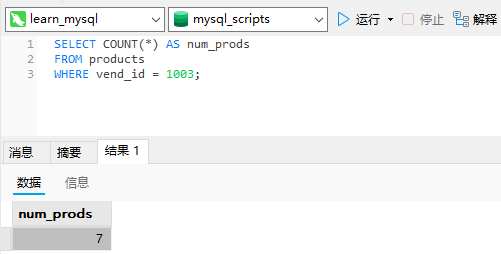
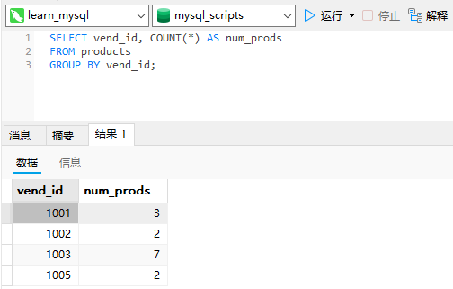
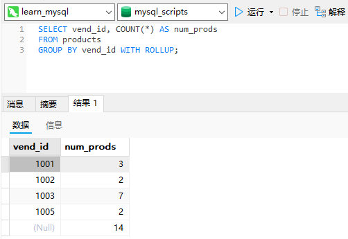
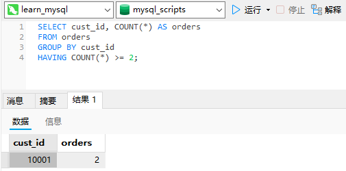
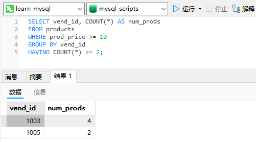
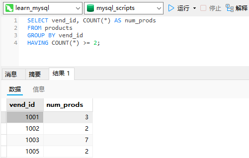
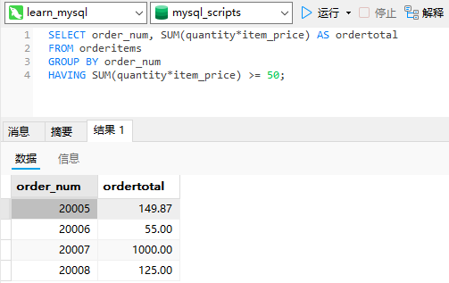
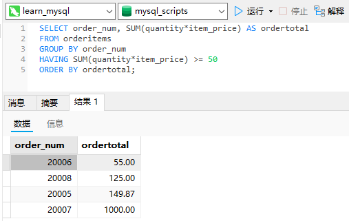

# 13_分组数据

## 数据分组

目前为止的所有计算都是在表的所有数据或匹配特定的`WHERE`子句的数据上进行的。下面的例子返回供应商1003提供的产品数目：

```sql
SELECT COUNT(*) AS num_prods
FROM products
WHERE vend_id = 1003;
```



如果要返回每个供应商提供的产品数目怎么办？或者返回只提供单项产品的供应商所提供的产品，或返回提供10个以上产品的供应商怎么办？

分组允许把数据分为多个逻辑组，以便能对每个组进行聚集计算。

## 创建分组

分组是在`SELECT`语句的`GROUP BY`子句中建立的。

```sql
SELECT vend_id, COUNT(*) AS num_prods
FROM products
GROUP BY vend_id;
```



上面的`SELECT`语句指定了两个列，`vend_id`包含产品供应商的ID，`num_prods`为计算字段（用COUNT(*)函数建立）。`GROUP BY`子句指示MySQL按`vend_id`排序并分组数据。这导致对每个`vend_id`而不是整个表计算`num_prods`一次。从输出中可以看到，供应商1001有3个产品，供应商1002有2个产品，供应商1003有7个产品，而供应商1005有2个产品。

因为使用了`GROUP BY`，就不必指定要计算和估值的每个组了。系统会自动完成。`GROUP BY`子句指示`MySQL`分组数据，然后对每个组而不是整个结果集进行聚集。

在具体使用`GROUP BY`子句前，需要知道一些重要的规定。

- `GROUP BY`子句可以包含任意数目的列。这使得能对分组进行嵌套，为数据分组提供更细致的控制。

- 如果在`GROUP BY`子句中嵌套了分组，数据将在最后规定的分组上进行汇总。换句话说，在建立分组时，指定的所有列都一起计算（所以不能从个别的列取回数据）。

- `GROUP BY`子句中列出的每个列都必须是检索列或有效的表达式（但不能是聚集函数）。如果在`SELECT`中使用表达式，则必须在`GROUP BY`子句中指定相同的表达式。不能使用别名。

- 除聚集计算语句外，`SELECT`语句中的每个列都必须在`GROUP BY`子句中给出。

- 如果分组列中具有`NULL`值，则`NULL`将作为一个分组返回。如果列中有多行`NULL`值，它们将分为一组。

- `GROUP BY`子句必须出现在WHERE子句之后，`ORDER BY`子句之前。

使用`ROLLUP`：使用`WITH ROLLUP`关键字，可以得到每个分组以及每个分组汇总级别（针对每个分组）的值，如下所示：

```sql
SELECT vend_id, COUNT(*) AS num_prods
FROM products
GROUP BY vend_id WITH ROLLUP;
```



## 过滤分组

除了能用`GROUP BY`分组数据外，MySQL还允许过滤分组，规定包括哪些分组，排除哪些分组。事实上，目前为止所学过的所有类型的`WHERE`子句都可以用HAVING来替代。唯一的差别是`WHERE`过滤行，而`HAVING`过滤分组。

```sql
SELECT cust_id, COUNT(*) AS orders
FROM orders
GROUP BY cust_id
HAVING COUNT(*) >= 2;
```



这条`SELECT`语句的前3行类似于上面的语句。最后一行增加了`HAVING`子句，它过滤`COUNT(*)=2`（两个以上的订单）的那些分组。

`HAVING`和`WHERE`的差别：这里有另一种理解方法，`WHERE`在数据分组前进行过滤，`HAVING`在数据分组后进行过滤。

列出具有2个（含）以上、价格为10（含）以上的产品的供应商：

```sql
SELECT vend_id, COUNT(*) AS num_prods
FROM products
WHERE prod_price >= 10
GROUP BY vend_id
HAVING COUNT(*) >= 2;
```



这条语句中，第一行是使用了聚集函数的基本`SELECT`，它与前面的例子很相像。`WHERE`子句过滤所有`prod_price`至少为10的行。然
后按`vend_id`分组数据，`HAVING`子句过滤计数为2或2以上的分组。如果没有`WHERE`子句，将会多检索出两行（供应商1002，销售的所有产品价格都在10以下；供应商1001，销售3个产品，但只有一个产品的价格大于等于10）：

```sql
SELECT vend_id, COUNT(*) AS num_prods
FROM products
GROUP BY vend_id
HAVING COUNT(*) >= 2;
```



## 分组和排序

虽然`GROUP BY`和`ORDER BY`经常完成相同的工作，但它们是非常不同的。

|                   ORDER BY                   |                         GROUP BY                         |
| :------------------------------------------: | :------------------------------------------------------: |
|                排序产生的输出                |             分组行。但输出可能不是分组的顺序             |
| 任意列都可以使用（甚至非选择的列也可以使用） | 只可能使用选择列或表达式列，而且必须使用每个选择列表达式 |
|                  不一定需要                  |     如果与聚集函数一起使用列（或表达式），则必须使用     |

我们经常发现用`GROUP BY`分组的数据确实是以分组顺序输出的。但情况并不总是这样，它并不是SQL规范所要求的。此外，用户也可能会要求以不同于分组的顺序排序。仅因为你以某种方式分组数据（获得特定的分组聚集值），并不表示你需要以相同的方式排序输出。应该提供明确的`ORDER BY`子句，即使其效果等同于`GROUP BY`子句也是如此。

不要忘记`ORDER BY`：一般在使用`GROUP BY`子句时，应该也给出`ORDER BY`子句。这是保证数据正确排序的唯一方法。千万不要仅依赖`GROUP BY`排序数据。

检索总计订单价格大于等于50的订单的订单号和总计订单价格：

```sql
SELECT order_num, SUM(quantity*item_price) AS ordertotal
FROM orderitems
GROUP BY order_num
HAVING SUM(quantity*item_price) >= 50;
```



为按总计订单价格排序输出，需要添加`ORDER BY`子句，如下所示：

```sql
SELECT order_num, SUM(quantity*item_price) AS ordertotal
FROM orderitems
GROUP BY order_num
HAVING SUM(quantity*item_price) >= 50
ORDER BY ordertotal;
```



在这个例子中，`GROUP BY`子句用来按订单号（`order_num`列）分组数据，以便`SUM(*)`函数能够返回总计订单价格。`HAVING`子句过滤数据，使得只返回总计订单价格大于等于50的订单。最后，用`ORDERBY`子句排序输出。

## `SELECT`子句顺序

|    子句    |        说明        |      是否必须使用      |
| :--------: | :----------------: | :--------------------: |
|  `SELECT`  | 要返回的列或表达式 |           是           |
|   `FROM`   |  从中检索数据的表  | 仅在从表选择数据时使用 |
|  `WHERE`   |      行级过滤      |           否           |
| `GROUP BY` |      分组说明      | 仅在按组计算聚集时使用 |
|  `HAVING`  |      组级过滤      |           否           |
| `ORDER BY` |    输出排序顺序    |           否           |
|  `LIMIT`   |    要检索的行数    |           否           |

