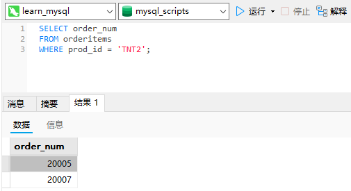
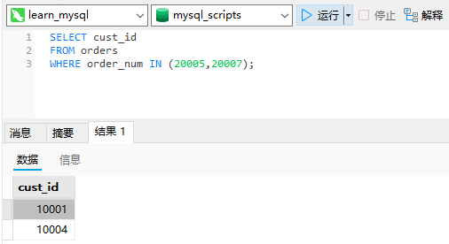
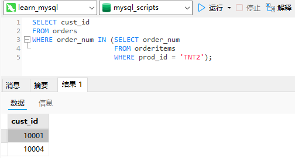
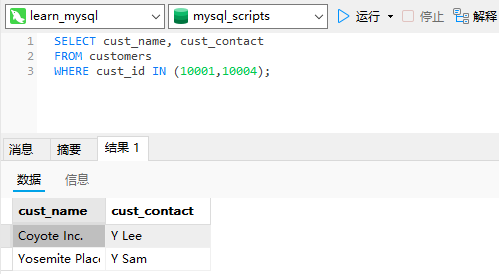
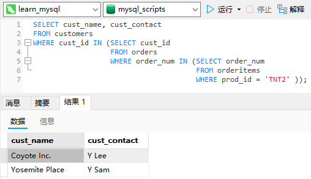
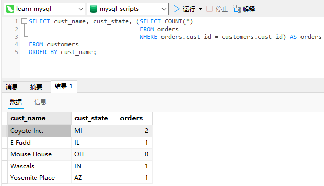

# 14_使用子查询

## 子查询

`SELECT`语句是SQL的查询。迄今为止我们所看到的所有`SELECT`语句都是简单查询，即从单个数据库表中检索数据的单条语句。

查询（query）：任何SQL语句都是查询。但此术语一般指`SELECT`语句。

SQL还允许创建子查询（subquery），即嵌套在其他查询中的查询。

## 利用子查询进行过滤

订单存储在两个表中。对于包含订单号、客户ID、订单日期的每个订单，`orders`表存储一行。各订单的物品存储在相关的`orderitems`表中。`orders`表不存储客户信息。它只存储客户的ID。实际的客户信息存储在`customers`表中。

现在，假如需要列出订购物品`TNT2`的所有客户，应该怎样检索？下面列出具体的步骤。

1. 检索包含物品`TNT2`的所有订单的编号。
2. 检索具有前一步骤列出的订单编号的所有客户的ID。
3. 检索前一步骤返回的所有客户ID的客户信息。

上述每个步骤都可以单独作为一个查询来执行。可以把一条`SELECT`语句返回的结果用于另一条`SELECT`语句的`WHERE`子句。

也可以使用子查询来把3个查询组合成一条语句。

第一条`SELECT`语句的含义很明确，对于`prod_id`为`TNT2`的所有订单物品，它检索其`order_num`列。输出列出两个包含此物品的订单：

```sql
SELECT order_num
FROM orderitems
WHERE prod_id = 'TNT2';
```



下一步，查询具有订单20005和20007的客户ID。利用第7章介绍的`IN`子句，编写如下的`SELECT`语句：

```sql
SELECT cust_id
FROM orders
WHERE order_num IN (20005,20007);
```



现在，把第一个查询（返回订单号的那一个）变为子查询组合两个查询。请看下面的SELECT语句：

```sql
SELECT cust_id
FROM orders
WHERE order_num IN (SELECT order_num
                    FROM orderitems
                    WHERE prod_id = 'TNT2');
```



在`SELECT`语句中，子查询总是从内向外处理。

在处理上面的`SELECT`语句时，MySQL实际上执行了两个操作。

首先，它执行下面的查询：

```sql
SELECT order_num FROM orderitems WHERE prod_id='TNT2'
```

此查询返回两个订单号：20005和20007。然后，这两个值以`IN`操作符要求的逗号分隔的格式传递给外部查询的`WHERE`子句。外部查询变成：

```sql
SELECT cust_id FROM orders WHERE order_num IN (20005,20007)
```

可以看到，输出是正确的并且与前面硬编码`WHERE`子句所返回的值相同。

现在得到了订购物品`TNT2`的所有客户的ID。下一步是检索这些客户ID的客户信息。检索两列的SQL语句为：

```sql
SELECT cust_name, cust_contact
FROM customers
WHERE cust_id IN (10001,10004);
```



可以把其中的`WHERE`子句转换为子查询而不是硬编码这些客户ID：

```sql
SELECT cust_name, cust_contact 
FROM customers 
WHERE cust_id IN (SELECT cust_id 
                  FROM orders 
                  WHERE order_num IN (SELECT order_num 
                                      FROM orderitems
                                      WHERE prod_id = 'TNT2' ));
```



列必须匹配：在`WHERE`子句中使用子查询（如这里所示），应该保证`SELECT`语句具有与`WHERE`子句中相同数目的列。通常，子查询将返回单个列并且与单个列匹配，但如果需要也可以使用多个列。

虽然子查询一般与`IN`操作符结合使用，但也可以用于测试等于（`=`）、不等于（`<`）等。

## 作为计算字段使用子查询

使用子查询的另一方法是创建计算字段。假如需要显示`customers`表中每个客户的订单总数。订单与相应的客户ID存储在`orders`表中。

为了执行这个操作，遵循下面的步骤。

1. 从`customers`表中检索客户列表。
2. 对于检索出的每个客户，统计其在`orders`表中的订单数目。

使用`SELECT COUNT(*)`对表中的行进行计数，并且通过提供一条`WHERE`子句来过滤某个特定的客户ID，可仅对该客户的订单进行计数。例如，下面的代码对客户10001的订单进行计数：

```sql
SELECT COUNT(*) AS orders
FROM orders
WHERE cust_id = 10001;
```

为了对每个客户执行`COUNT(*)`计算，应该将`COUNT(*)`作为一个子查询。请看下面的代码：

```sql
SELECT cust_name, cust_state, (SELECT COUNT(*)
                               FROM orders
                               WHERE orders.cust_id = customers.cust_id) AS orders
FROM customers
ORDER BY cust_name;
```



这条`SELECT`语句对`customers`表中每个客户返回3列：`cust_name`、`cust_state`和`orders`。`orders`是一个计算字段，它是由圆括号中的子查询建立的。该子查询对检索出的每个客户执行一次。在此例子中，该子查询执行了5次，因为检索出了5个客户。

子查询中的`WHERE`子句与前面使用的`WHERE`子句稍有不同，因为它使用了完全限定列名。下面的语句告诉SQL比较`orders`表中的`cust_id`与当前正从`customers`表中检索的`cust_id`：

```sql
WHERE orders.cust_id = customers.cust_id
```

相关子查询（correlated subquery）：涉及外部查询的子查询。

这种类型的子查询称为相关子查询。任何时候只要列名可能有多义性，就必须使用这种语法（表名和列名由一个句点分隔）。

逐渐增加子查询来建立查询：用子查询测试和调试查询很有技巧性，特别是在这些语句的复杂性不断增加的情况下更是如此。用子查询建立（和测试）查询的最可靠的方法是逐渐进行，这与MySQL处理它们的方法非常相同。首先，建立和测试最内层的查询。然后，用硬编码数据建立和测试外层查询，并且仅在确认它正常后才嵌入子查询。这时，再次测试它。对于要增加的每个查询，重复这些步骤。这样做仅给构造查询增加了一点点时间，但节省了以后（找出查询为什么不正常）的大量时间，并且极大地提高了查询一开始就正常工作的可能性。