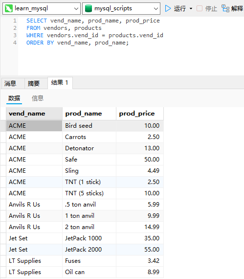
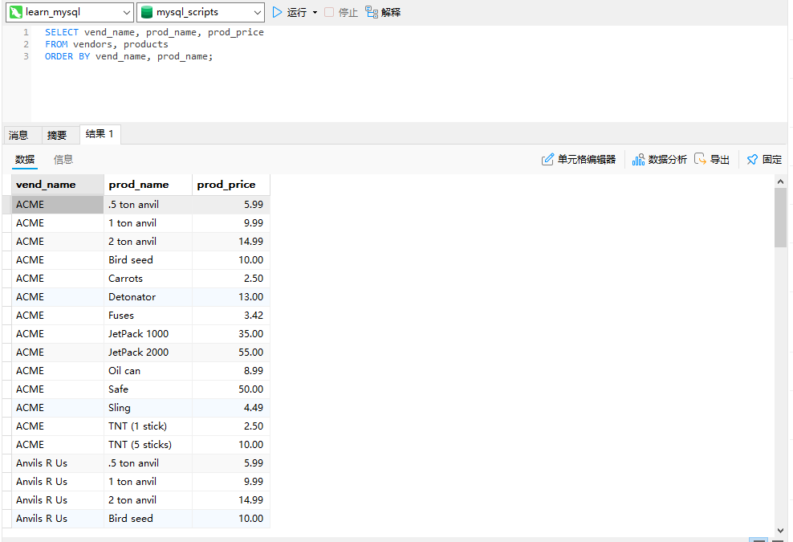
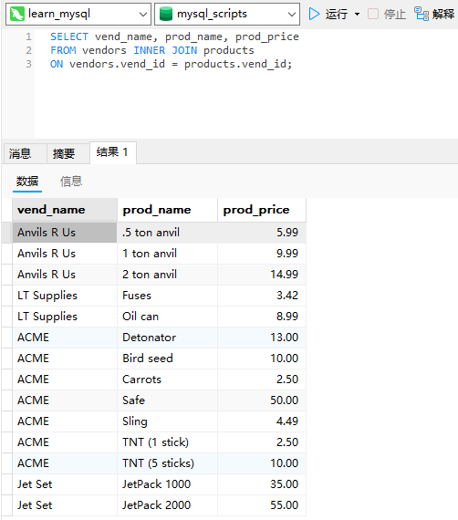
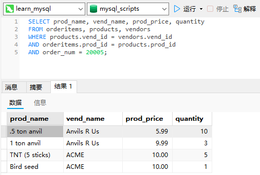

# 15_联结表

## 联结

### 关系表

假如有一个包含产品目录的数据库表，其中每种类别的物品占一行。对于每种物品要存储的信息包括产品描述和价格，以及生产该产品的供应商信息。

现在，假如有由同一供应商生产的多种物品，那么在何处存储供应商信息（如，供应商名、地址、联系方法等）呢？将这些数据与产品息分开存储的理由如下。

- 因为同一供应商生产的每个产品的供应商信息都是相同的，对每个产品重复此信息既浪费时间又浪费存储空间。

- 如果供应商信息改变（例如，供应商搬家或电话号码变动），只需改动一次即可。
- 如果有重复数据（即每种产品都存储供应商信息），很难保证每次输入该数据的方式都相同。不一致的数据在报表中很难利用。

关键是，相同数据出现多次决不是一件好事，此因素是关系数据库设计的基础。关系表的设计就是要保证把信息分解成多个表，一类数据一个表。各表通过某些常用的值（即关系设计中的关系（relation））互相关联。

在这个例子中，可建立两个表，一个存储供应商信息，另一个存储产品信息。`vendors`表包含所有供应商信息，每个供应商占一行，每个供应商具有唯一的标识。此标识称为主键（primary key），可以是供应商ID或任何其他唯一值。`products`表只存储产品信息，它除了存储供应商ID（`vendors`表的主键）外不存储其他供应商信息。`vendors`表的主键又叫作`products`的外键，它将`vendors`表与`products`表关联，利用供应商ID能从`vendors`表中找出相应供应商的详细信息。

外键（foreign key）：外键为某个表中的一列，它包含另一个表的主键值，定义了两个表之间的关系。

这样做的好处如下：

- 供应商信息不重复，从而不浪费时间和空间；
- 如果供应商信息变动，可以只更新`vendors`表中的单个记录，相关表中的数据不用改动；
- 由于数据无重复，显然数据是一致的，这使得处理数据更简单。

总之，关系数据可以有效地存储和方便地处理。因此，关系数据库的可伸缩性远比非关系数据库要好。

可伸缩性（scale）：能够适应不断增加的工作量而不失败。设计良好的数据库或应用程序称之为可伸缩性好（scale well）。

### 为什么要使用联结

如果数据存储在多个表中，怎样用单条`SELECT`语句检索出数据？

答案是使用联结。简单地说，联结是一种机制，用来在一条`SELECT`语句中关联表，因此称之为联结。使用特殊的语法，可以联结多个表返回一组输出，联结在运行时关联表中正确的行。

维护引用完整性：重要的是，要理解联结不是物理实体。换句话说，它在实际的数据库表中不存在。联结由MySQL根据需要建立，它存在于查询的执行当中。在使用关系表时，仅在关系列中插入合法的数据非常重要。回到这里的例子，如果在`products`表中插入拥有非法供应商ID（即没有在`vendors`表中出现）的供应商生产的产品，则这些产品是不可访问的，因为它们没有关联到某个供应商。为防止这种情况发生，可指示MySQL只允许在`products`表的供应商ID列中出现合法值（即出现在`vendors`表中的供应商）。这就是维护引用完整性，它是通过在表的定义中指定主键和外键来实现的。

## 创建联结

联结的创建非常简单，规定要联结的所有表以及它们如何关联即可。请看下面的例子：

```sql
SELECT vend_name, prod_name, prod_price
FROM vendors, products
WHERE vendors.vend_id = products.vend_id
ORDER BY vend_name, prod_name;
```



`SELECT`语句与前面所有语句一样指定要检索的列。这里，最大的差别是所指定的两个列（`prod_name`和`prod_price`）在一个表中，而另一个列（`vend_name`）在另一个表中。现在来看`FROM`子句。与以前的`SELECT`语句不一样，这条语句的`FROM`子句列出了两个表，分别是`vendors`和`products`。它们就是这条`SELECT`语句联结的两个表的名字。这两个表用`WHERE`子句正确联结，`WHERE`子句指示MySQL匹配`vendors`表中的`vend_id`和`products`表中的`vend_id`。可以看到要匹配的两个列以`vendors.vend_id`和`products.vend_id`指定。这里需要这种完全限定列名，因为如果只给出`vend_id`，则MySQL不知道指的是哪一个（它们有两个，每个表中一个）。

### WHERE子句的重要性

在一条`SELECT`语句中联结几个表时，相应的关系是在运行中构造的。

在联结两个表时，你实际上做的是将第一个表中的每一行与第二个表中的每一行配对。`WHERE`子句作为过滤条件，它只包含那些匹配给定条件（这里是联结条件）的行。没有`WHERE`子句，第一个表中的每个行将与第二个表中的每个行配对，而不管它们逻辑上是否可以配在一起。

笛卡儿积（cartesianproduct）：由没有联结条件的表关系返回的结果为笛卡儿积。检索出的行的数目将是第一个表中的行数乘以第二个表中的行数。

```sql
SELECT vend_name, prod_name, prod_price
FROM vendors, products
ORDER BY vend_name, prod_name;
```



从上面的输出中可以看到，相应的笛卡儿积不是我们所想要的。这里返回的数据用每个供应商匹配了每个产品，它包括了供应商不正确的产品。实际上有的供应商根本就没有产品。

### 内部联结

目前为止所用的联结称为等值联结（equal join），它基于两个表之间的相等测试。这种联结也称为内部联结。其实，对于这种联结可以使用稍微不同的语法来明确指定联结的类型。下面的`SELECT`语句返回与前面例子完全相同的数据：

```sql
SELECT vend_name, prod_name, prod_price
FROM vendors INNER JOIN products
ON vendors.vend_id = products.vend_id;
```



此语句中的`SELECT`与前面的`SELECT`语句相同，但`FROM`子句不同。这里，两个表之间的关系是`FROM`子句的组成部分，以`INNER JOIN`指定。在使用这种语法时，联结条件用特定的`ON`子句而不是`WHERE`子句给出。传递给`ON`的实际条件与传递给`WHERE`的相同。

### 联结多个表

SQL对一条`SELECT`语句中可以联结的表的数目没有限制。创建联结的基本规则也相同。首先列出所有表，然后定义表之间的关系。例如：

```sql
SELECT prod_name, vend_name, prod_price, quantity
FROM orderitems, products, vendors
WHERE products.vend_id = vendors.vend_id
AND orderitems.prod_id = products.prod_id
AND order_num = 20005;
```

```sql
SELECT prod_name, vend_name, prod_price, quantity
FROM orderitems
INNER JOIN products ON orderitems.prod_id = products.prod_id
INNER JOIN vendors ON products.vend_id = vendors.vend_id
WHERE order_num = 20005;
```



此例子显示编号为20005的订单中的物品。订单物品存储在`orderitems`表中。每个产品按其产品ID存储，它引用`products`表中的产品。这些产品通过供应商ID联结到`vendors`表中相应的供应商，供应商ID存储在每个产品的记录中。这里的`FROM`子句列出了3个表，而`WHERE`子句定义了这两个联结条件，而第三个联结条件用来过滤出订单20005中的物品。