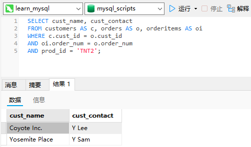
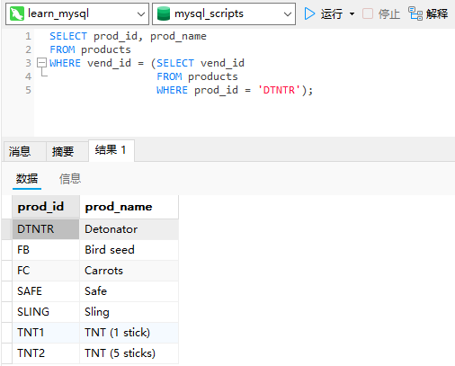
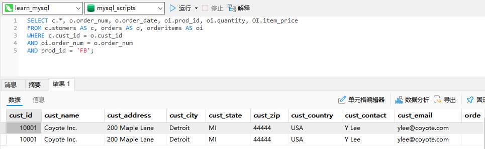
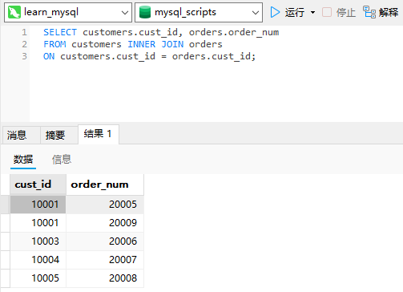
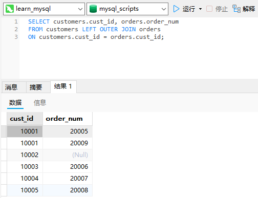
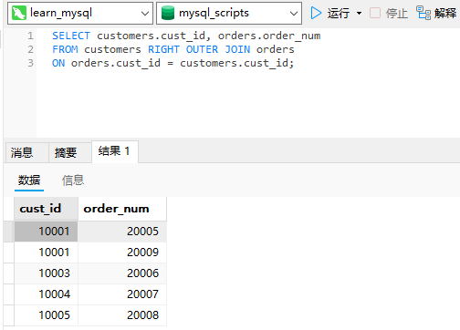
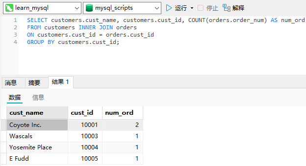
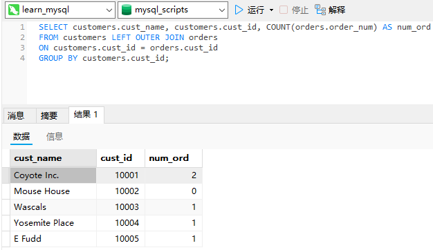

# 16_创建高级联结

## 使用表别名

别名除了用于列名和计算字段外，SQL还允许给表名起别名。这样做有两个主要理由：

- 缩短SQL语句；
- 允许在单条`SELECT`语句中多次使用相同的表。

```sql
SELECT cust_name, cust_contact
FROM customers AS c, orders AS o, orderitems AS oi
WHERE c.cust_id = o.cust_id
AND oi.order_num = o.order_num
AND prod_id = 'TNT2';
```



应该注意，表别名只在查询执行中使用。与列别名不一样，表别名不返回到客户机。

## 使用不同类型的联结

### 自联结

假如你发现某物品（其ID为`DTNTR`）存在问题，因此想知道生产该物品的供应商生产的其他物品是否也存在这些问题。此查询要求首先找到生产ID为`DTNTR`的物品的供应商，然后找出这个供应商生产的其他物品。下面是解决此问题的一种方法：

```sql
SELECT prod_id, prod_name
FROM products
WHERE vend_id = (SELECT vend_id
                 FROM products
                 WHERE prod_id = 'DTNTR');
```



这是第一种解决方案，它使用了子查询。内部的`SELECT`语句做了一个简单的检索，返回生产ID为`DTNTR`的物品供应商的`vend_id`。该ID用于外部查询的`WHERE`子句中，以便检索出这个供应商生产的所有物品。

```sql
SELECT p1.prod_id, p1.prod_name
FROM products AS p1, products AS p2
WHERE p1.vend_id = p2.vend_id
AND p2.prod_id = 'DTNTR';
```

用自联结而不用子查询：自联结通常作为外部语句用来替代从相同表中检索数据时使用的子查询语句。虽然最终的结果是相同的，但有时候处理联结远比处理子查询快得多。

### 自然联结

无论何时对表进行联结，应该至少有一个列出现在不止一个表中（被联结的列）。标准的联结返回所有数据，甚至相同的列多次出现。自然联结排除多次出现，使每个列只返回一次。

```sql
SELECT c.*, o.order_num, o.order_date, oi.prod_id, oi.quantity, OI.item_price
FROM customers AS c, orders AS o, orderitems AS oi
WHERE c.cust_id = o.cust_id
AND oi.order_num = o.order_num
AND prod_id = 'FB';
```



在这个例子中，通配符只对第一个表使用。所有其他列明确列出，所以没有重复的列被检索出来。

### 外部联结

许多联结将一个表中的行与另一个表中的行相关联。但有时候会需要包含没有关联行的那些行。例如，可能需要使用联结来完成以下工作：

- 对每个客户下了多少订单进行计数，包括那些至今尚未下订单的客户；
- 列出所有产品以及订购数量，包括没有人订购的产品；
- 计算平均销售规模，包括那些至今尚未下订单的客户。

在上述例子中，联结包含了那些在相关表中没有关联行的行。这种类型的联结称为外部联结。

下面的`SELECT`语句给出一个简单的内部联结。它检索所有客户及其订单：

```sql
SELECT customers.cust_id, orders.order_num
FROM customers INNER JOIN orders
ON customers.cust_id = orders.cust_id;
```



外部联结语法类似。为了检索所有客户，包括那些没有订单的客户：

```sql
SELECT customers.cust_id, orders.order_num
FROM customers LEFT OUTER JOIN orders
ON customers.cust_id = orders.cust_id;
```



这条`SELECT`语句使用了关键字`OUTER JOIN`来指定联结的类型（而不是在`WHERE`子句中指定）。但是，与内部联结关联两个表中的行不同的是，外部联结还包括没有关联行的行。在使用`OUTER JOIN`语法时，必须使用`RIGHT`或`LEFT`关键字指定包括其所有行的表（`RIGHT`指出的是`OUTER JOIN`右边的表，而`LEFT`指出的是`OUTER JOIN`左边的表）。上面的例子使用`LEFT OUTER JOIN`从`FROM`子句的左边表（`customers`表）中选择所有行。为了从右边的表中选择所有行，应该使用`RIGHT OUTER JOIN`，如下例所示：

```sql
SELECT customers.cust_id, orders.order_num
FROM customers RIGHT OUTER JOIN orders
ON orders.cust_id = customers.cust_id;
```



外部联结的类型存在两种基本的外部联结形式：左外部联结和右外部联结。它们之间的唯一差别是所关联的表的顺序不同。换句话说，左外部联结可通过颠倒`FROM`或`WHERE`子句中表的顺序转换为右外部联结。因此，两种类型的外部联结可互换使用，而究竟使用哪一种纯粹是根据方便而定。

## 使用带聚集函数的联结

如果要检索所有客户及每个客户所下的订单数，下面使用了`COUNT()`函数的代码可完成此工作：

```sql
SELECT customers.cust_name, customers.cust_id, COUNT(orders.order_num) AS num_ord
FROM customers INNER JOIN orders
ON customers.cust_id = orders.cust_id
GROUP BY customers.cust_id;
```



此`SELECT`语句使用`INNER JOIN`将`customers`和`orders`表互相关联。`GROUP BY`子句按客户分组数据，因此，函数调用
`COUNT(orders.order_num)`对每个客户的订单计数，将它作为`num_ord`返回。

聚集函数也可以方便地与其他联结一起使用。请看下面的例子：

```sql
SELECT customers.cust_name, customers.cust_id, COUNT(orders.order_num) AS num_ord
FROM customers LEFT OUTER JOIN orders
ON customers.cust_id = orders.cust_id
GROUP BY customers.cust_id;
```



这个例子使用左外部联结来包含所有客户，甚至包含那些没有任何下订单的客户。结果显示也包含了客户Mouse House，它有0个订单。

## 使用联结和联结条件

关于联结及其使用的某些要点。

- 注意所使用的联结类型。一般我们使用内部联结，但使用外部联结也是有效的。
- 保证使用正确的联结条件，否则将返回不正确的数据。
- 应该总是提供联结条件，否则会得出笛卡儿积。
- 在一个联结中可以包含多个表，甚至对于每个联结可以采用不同的联结类型。虽然这样做是合法的，一般也很有用，但应该在一起测试它们前，分别测试每个联结。这将使故障排除更为简单。