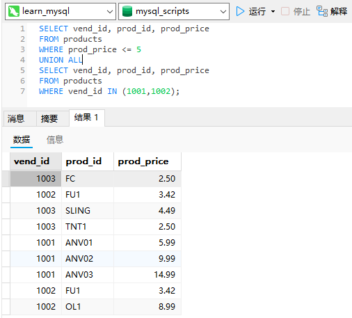

# 17_组合查询

## 组合查询

多数SQL查询都只包含从一个或多个表中返回数据的单条`SELECT`语句。MySQL也允许执行多个查询（多条`SELECT`语句），并将结果作为单个查询结果集返回。这些组合查询通常称为并（union）或复合查询（compound query）。

有两种基本情况，其中需要使用组合查询：

- 在单个查询中从不同的表返回类似结构的数据；
- 对单个表执行多个查询，按单个查询返回数据。

组合查询和多个`WHERE`条件：多数情况下，组合相同表的两个查询完成的工作与具有多个`WHERE`子句条件的单条查询完成的工作相同。换句话说，任何具有多个`WHERE`子句的`SELECT`语句都可以作为一个组合查询给出。

## 创建组合查询

利用`UNION`，可给出多条`SELECT`语句，将它们的结果组合成单个结果集。

### 使用`UNION`

`UNION`的使用很简单。所需做的只是给出每条`SELECT`语句，在各条语句之间放上关键字`UNION`。

假如需要价格小于等于5的所有物品的一个列表，而且还想包括供应商1001和1002生产的所有物品（不考虑价格）。

```sql
SELECT vend_id, prod_id, prod_price
FROM products
WHERE prod_price <= 5
UNION
SELECT vend_id, prod_id, prod_price
FROM products
WHERE vend_id IN (1001,1002);
```


```sql
SELECT vend_id, prod_id, prod_price
FROM products
WHERE prod_price <= 5
OR vend_id IN (1001,1002);
```

在这个简单的例子中，使用`UNION`可能比使用`WHERE`子句更为复杂。但对于更复杂的过滤条件，或者从多个表（而不是单个表）中检索数据的情形，使用`UNION`可能会使处理更简单。

### `UNION`规则

- `UNION`必须由两条或两条以上的`SELECT`语句组成，语句之间用关键字`UNION`分隔（因此，如果组合4条`SELECT`语句，将要使用3个`UNION`关键字）。
- `UNION`中的每个查询必须包含相同的列、表达式或聚集函数（不过各个列不需要以相同的次序列出）。
- 列数据类型必须兼容：类型不必完全相同，但必须是DBMS可以隐含地转换的类型（例如，不同的数值类型或不同的日期类型）。

### 包含或取消重复的行

在使用`UNION`时，重复的行被自动取消。事实上，如果想返回所有匹配行，可使用`UNION ALL`而不是`UNION`。

```sql
SELECT vend_id, prod_id, prod_price
FROM products
WHERE prod_price <= 5
UNION ALL
SELECT vend_id, prod_id, prod_price
FROM products
WHERE vend_id IN (1001,1002);
```



使用`UNION ALL`，MySQL不取消重复的行。

### 对组合查询结果排序

`SELECT`语句的输出用`ORDER BY`子句排序。在用`UNION`组合查询时，只能使用一条`ORDER BY`子句，它必须出现在最后一条`SELECT`语句之后。

```sql
SELECT vend_id, prod_id, prod_price
FROM products
WHERE prod_price <= 5
UNION
SELECT vend_id, prod_id, prod_price
FROM products
WHERE vend_id IN (1001,1002)
ORDER BY vend_id, prod_price;
```


这条`UNION`在最后一条`SELECT`语句后使用了`ORDER BY`子句。虽然`ORDER BY`子句似乎只是最后一条`SELECT`语句的组成部分，但实际上MySQL将用它来排序所有`SELECT`语句返回的所有结果。