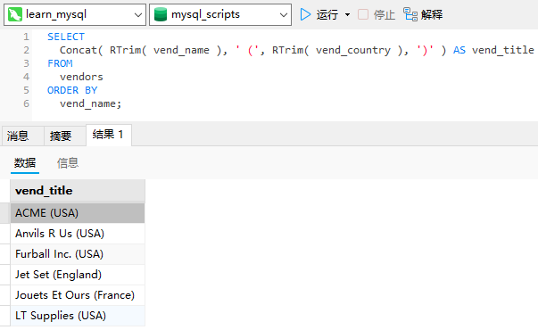

# 22_使用视图

## 视图

视图是虚拟的表。与包含数据的表不一样，视图只包含使用时动态检索数据的查询。

```sql
SELECT
  cust_name,
  cust_contact 
FROM
  customers,
  orders,
  orderitems 
WHERE
  customers.cust_id = orders.cust_id 
  AND orderitems.order_num = orders.order_num 
  AND prod_id = 'TNT2';
```

此查询用来检索订购了某个特定产品的客户。任何需要这个数据的人都必须理解相关表的结构，并且知道如何创建查询和对表进行联结。为了检索其他产品（或多个产品）的相同数据，必须修改最后的WHERE子句。

现在，假如可以把整个查询包装成一个名为`productcustomers`的虚拟表，则可以如下轻松地检索出相同的数据：

```sql
SELECT
  cust_name,
  cust_contact 
FROM
  productcustomers 
WHERE
  prod_id = 'TNT2';
```

这就是视图的作用。productcustomers是一个视图，作为视图，它不包含表中应该有的任何列或数据，它包含的是一个SQL查询（与上面用以正确联结表的相同的查询）。

### 为什么使用视图

下面是视图的一些常见应用。

- 重用SQL语句。
- 简化复杂的SQL操作。在编写查询后，可以方便地重用它而不必知道它的基本查询细节。
- 使用表的组成部分而不是整个表。
- 保护数据。可以给用户授予表的特定部分的访问权限而不是整个表的访问权限。
- 更改数据格式和表示。视图可返回与底层表的表示和格式不同的数据。

视图本身不包含数据，因此它们返回的数据是从其他表中检索出来的。在添加或更改这些表中的数据时，视图将返回改变过的数据。

### 视图的规则和限制

下面是关于视图创建和使用的一些最常见的规则和限制。

- 与表一样，视图必须唯一命名。
- 对于可以创建的视图数目没有限制。
- 为了创建视图，必须具有足够的访问权限。这些限制通常由数据库管理人员授予。
- 视图可以嵌套，即可以利用从其他视图中检索数据的查询来构造一个视图。
- `ORDER BY`可以用在视图中，但如果从该视图检索数据`SELECT`中也含有`ORDER BY`，那么该视图中的`ORDER BY`将被覆盖。
- 视图不能索引，也不能有关联的触发器或默认值。
- 视图可以和表一起使用。例如，编写一条联结表和视图的`SELECT`语句。

## 使用视图

视图的创建。

- 视图用`CREATE VIEW`语句来创建。
- 使用`SHOW CREATE VIEW viewname;`来查看创建视图的语句。
- 用`DROP`删除视图，其语法为`DROP VIEW viewname;`。
- 更新视图时，可以先用`DROP`再用`CREATE`，也可以直接用`CREATE OR REPLACE VIEW`。如果要更新的视图不存在，则第2条更新语句会创建一个视图；如果要更新的视图存在，则第2条更新语句会替换原有视图。

### 利用视图简化复杂的联结

视图的最常见的应用之一是隐藏复杂的SQL，这通常都会涉及联结。

```sql
CREATE VIEW productcustomers AS SELECT
cust_name,
cust_contact,
prod_id 
FROM
  customers,
  orders,
  orderitems 
WHERE
  customers.cust_id = orders.cust_id 
  AND orderitems.order_num = orders.order_num;
```

这条语句创建一个名为`productcustomers`的视图，它联结三个表，以返回已订购了任意产品的所有客户的列表。如果执行`SELECT * FROM productcustomers`，将列出订购了任意产品的客户。

为检索订购了产品TNT2的客户，可如下进行：

```sql
SELECT
  cust_name,
  cust_contact 
FROM
  productcustomers 
WHERE
  prod_id = 'TNT2';
```


这条语句通过`WHERE`子句从视图中检索特定数据。在MySQL处理此查询时，它将指定的`WHERE`子句添加到视图查询中的已有`WHERE`子句中，以便正确过滤数据。

可以看出，视图极大地简化了复杂SQL语句的使用。利用视图，可一次性编写基础的SQL，然后根据需要多次使用。

### 用视图重新格式化检索出的数据

视图的另一常见用途是重新格式化检索出的数据。下面的`SELECT`语句在单个组合计算列中返回供应商名和位置：

```sql
SELECT
  Concat( RTrim( vend_name ), ' (', RTrim( vend_country ), ')' ) AS vend_title 
FROM
  vendors 
ORDER BY
  vend_name;
```



现在，假如经常需要这个格式的结果。不必在每次需要时执行联结，创建一个视图，每次需要时使用它即可。为把此语句转换为视图，可按如下进行：

```sql
CREATE VIEW vendorlocations AS SELECT
Concat( RTrim( vend_name ), ' (', RTrim( vend_country ), ')' ) AS vend_title 
FROM
  vendors 
ORDER BY
  vend_name;
```

这条语句使用与以前的`SELECT`语句相同的查询创建视图。为了检索出以创建所有邮件标签的数据，可如下进行：

```sql
SELECT
  * 
FROM
  vendorlocations;
```


### 用视图过滤不想要的数据

视图对于应用普通的`WHERE`子句也很有用。例如，可以定义`customeremaillist`视图，它过滤没有电子邮件地址的客户。为此
目的，可使用下面的语句：

```sql
CREATE VIEW customeremaillist AS SELECT
cust_id,
cust_name,
cust_email 
FROM
  customers 
WHERE
  cust_email IS NOT NULL;
```


显然，在发送电子邮件到邮件列表时，需要排除没有电子邮件地址的用户。这里的`WHERE`子句过滤了`cust_email`列中具有NULL值的那些行，使他们不被检索出来。

现在，可以像使用其他表一样使用视图`customeremaillist`。

```sql
SELECT
  * 
FROM
  customeremaillist;
```


### 使用视图与计算字段

视图对于简化计算字段的使用特别有用。

```sql
SELECT
  prod_id,
  quantity,
  item_price,
  quantity * item_price AS expanded_price 
FROM
  orderitems 
WHERE
  order_num = 20005;
```


为将其转换为一个视图，如下进行：

```sql
CREATE VIEW orderitemsexpanded AS SELECT
order_num,
prod_id,
quantity,
item_price,
quantity * item_price AS expanded_price 
FROM
  orderitems;
```

为检索订单20005的详细内容（上面的输出），如下进行：

```sql
SELECT
  * 
FROM
  orderitemsexpanded 
WHERE
  order_num = 20005;
```


正确使用，视图可极大地简化复杂的数据处理。

### 更新视图

如果你对视图增加或删除行，实际上是对其基表增加或删除行。

如果视图定义中有以下操作，则不能进行视图的更新：

- 分组（使用`GROUP BY`和`HAVING`）；
- 联结；
- 子查询；
- 并；
- 聚集函数（`Min()`、`Count()`、`Sum()`等）；
- `DISTINCT`；
- 导出（计算）列。

一般，应该将视图用于检索（`SELECT`语句）而不用于更新（`INSERT`、`UPDATE`和`DELETE`）。