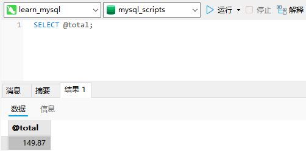

# 23_使用存储过程

## 存储过程

迄今为止，使用的大多数SQL语句都是针对一个或多个表的单条语句。并非所有操作都这么简单，经常会有一个完整的操作需要多条语句才能完成。例如，考虑以下的情形。

- 为了处理订单，需要核对以保证库存中有相应的物品。

- 如果库存有物品，这些物品需要预定以便不将它们再卖给别的人，并且要减少可用的物品数量以反映正确的库存量。
- 库存中没有的物品需要订购，这需要与供应商进行某种交互。
- 关于哪些物品入库（并且可以立即发货）和哪些物品退订，需要通知相应的客户。

存储过程简单来说，就是为以后的使用而保存的一条或多条MySQL语句的集合。

## 为什么要使用存储过程

- 通过把处理封装在容易使用的单元中，简化复杂的操作。

- 由于不要求反复建立一系列处理步骤，这保证了数据的完整性。

如果所有开发人员和应用程序都使用同一（试验和测试）存储过程，则所使用的代码都是相同的。

- 简化对变动的管理。如果表名、列名或业务逻辑（或别的内容）有变化，只需要更改存储过程的代码。使用它的人员甚至不需要知道这些变化。

这一点的延伸就是安全性。通过存储过程限制对基础数据的访问减少了数据讹误（无意识的或别的原因所导致的数据讹误）的机会。

- 提高性能。因为使用存储过程比使用单独的SQL语句要快。
- 存在一些只能用在单个请求中的MySQL元素和特性，存储过程可以使用它们来编写功能更强更灵活的代码。

换句话说，使用存储过程有3个主要的好处，即简单、安全、高性能。显然，它们都很重要。不过，在将SQL代码转换为存储过程前，也必须知道它的一些缺陷。

- 一般来说，存储过程的编写比基本SQL语句复杂，编写存储过程需要更高的技能，更丰富的经验。

- 你可能没有创建存储过程的安全访问权限。许多数据库管理员限制存储过程的创建权限，允许用户使用存储过程，但不允许他们创建存储过程。

## 使用存储过程

### 执行存储过程

MySQL称存储过程的执行为调用，因此MySQL执行存储过程的语句为`CALL`。

`CALL`接受存储过程的名字以及需要传递给它的任意参数。

```sql
CALL productpricing ( @pricelow, @pricehigh, @priceaverage );
```

其中，执行名为`productpricing`的存储过程，它计算并返回产品的最低、最高和平均价格。

### 创建存储过程

一个返回产品平均价格的存储过程。

```sql
CREATE PROCEDURE productpricing () BEGIN
  SELECT
    Avg( prod_price ) AS priceaverage 
  FROM
  products;
END;
```

此存储过程名为`productpricing`，用`CREATE PROCEDURE productpricing()`语句定义。如果存储过程接受参数，它们将在`()`中列举出来。此存储过程没有参数，但后跟的`()`仍然需要。`BEGIN`和`END`语句用来限定存储过程体，过程体本身仅是一个简单的`SELECT`语句。

在MySQL处理这段代码时，它创建一个新的存储过程`productpricing`。没有返回数据，因为这段代码并未调用存储过程，这里只是为以后使用而创建它。

那么，如何使用这个存储过程？

```sql
CALL productpricing();
```


`CALL productpricing();`执行刚创建的存储过程并显示返回的结果。因为存储过程实际上是一种函数，所以存储过程名后需要有`()`符号（即使不传递参数也需要）。

### 删除存储过程

存储过程在创建之后，被保存在服务器上以供使用，直至被删除。

为删除刚创建的存储过程，可使用以下语句：

```sql
DROP PROCEDURE productpricing;
```

这条语句删除刚创建的存储过程。请注意没有使用后面的()，只给出存储过程名。

仅当存在时删除：如果指定的过程不存在，则`DROP PROCEDURE`将产生一个错误。当过程存在想删除它时（如果过程不存在也不产生错误）可使用`DROP PROCEDURE IF EXISTS`。

### 使用参数

`productpricing`只是一个简单的存储过程，它简单地显示`SELECT`语句的结果。一般，存储过程并不显示结果，而是把结果返回给你指定的变量。

变量（variable）：内存中一个特定的位置，用来临时存储数据。

以下是`productpricing`的修改版本（如果不先删除此存储过程，则不能再次创建它）：

```sql
CREATE PROCEDURE productpricing ( OUT pl DECIMAL ( 8, 2 ), OUT ph DECIMAL ( 8, 2 ), OUT pa DECIMAL ( 8, 2 ) ) BEGIN
  SELECT
    Min( prod_price ) INTO pl 
  FROM
    products;
  SELECT
    Max( prod_price ) INTO ph 
  FROM
    products;
  SELECT
    Avg( prod_price ) INTO pa 
  FROM
  products;
END;
```


此存储过程接受3个参数：`pl`存储产品最低价格，`ph`存储产品最高价格，`pa`存储产品平均价格。每个参数必须具有指定的类型，这里使用十进制值。关键字`OUT`指出相应的参数用来从存储过程传出一个值（返回给调用者）。MySQL支持`IN`（传递给存储过程）、`OUT`（从存储过程传出，如这里所用）和`INOUT`（对存储过程传入和传出）类型的参数。存储过程的代码位于`BEGIN`和`END`语句内，如前所见，它们是一系列`SELECT`语句，用来检索值，然后保存到相应的变量（通过指定`INTO`关键字）。

为调用此修改过的存储过程，必须指定3个变量名，如下所示：

```sql
CALL productpricing ( @pricelow, @pricehigh, @priceaverage );
```

由于此存储过程要求3个参数，因此必须正好传递3个参数，不多也不少。所以，这条`CALL`语句给出3个参数。它们是存储过程将保存结果的3个变量的名字。

变量名：所有MySQL变量都必须以`@`开始。

在调用时，这条语句并不显示任何数据。它返回以后可以显示（或在其他处理中使用）的变量。

为了获得3个值，可使用以下语句：

```sql
SELECT
  @pricehigh,
  @pricelow,
  @priceaverage;
```


下面是另外一个例子，这次使用`IN`和`OUT`参数。`ordertotal`接受订单号并返回该订单的合计：

```sql
CREATE PROCEDURE ordertotal ( IN onumber INT, OUT ototal DECIMAL ( 8, 2 ) ) BEGIN
  SELECT
    Sum( item_price * quantity ) 
  FROM
    orderitems 
  WHERE
  order_num = onumber INTO ototal;
END;
```

`onumber`定义为`IN`，因为订单号被传入存储过程。`ototal`定义为`OUT`，因为要从存储过程返回合计。`SELECT`语句使用这两个参数，`WHERE`子句使用`onumber`选择正确的行，`INTO`使用`ototal`存储计算出来的合计。

为调用这个新存储过程，可使用以下语句：

```sql
CALL ordertotal ( 20005, @total );
```

必须给`ordertotal`传递两个参数；第一个参数为订单号，第二个参数为包含计算出来的合计的变量名。

为了显示此合计，可如下进行：

```sql
SELECT @total;
```



```sql
CALL ordertotal(20009, @total);
```


### 建立智能存储过程

考虑这个场景。你需要获得与以前一样的订单合计，但需要对合计增加营业税，不过只针对某些顾客（或许是你所在州中那些顾客）。那么，你需要做下面几件事情：

- 获得合计（与以前一样）；

- 把营业税有条件地添加到合计；

- 返回合计（带或不带税）。

存储过程的完整工作如下：

```sql
-- Name: ordertotal
-- Parameters: onumber = order number
-- taxable = 0 if not taxable, 1 if taxable
-- ototal = order total variable
CREATE PROCEDURE ordertotal ( IN onumber INT, IN taxable BOOLEAN, OUT ototal DECIMAL ( 8, 2 ) ) COMMENT 'Obtain order total, optionally adding tax' BEGIN-- Declare variable for total
  DECLARE
    total DECIMAL ( 8, 2 );-- Declare tax percentage
  DECLARE
    taxrate INT DEFAULT 6;-- Get the order total
  SELECT
    Sum( item_price * quantity ) 
  FROM
    orderitems 
  WHERE
    order_num = onumber INTO total;-- Is this taxable?
  IF
    taxable THEN-- Yes, so add taxrate to the total
    SELECT
      total +(
        total / 100 * taxrate 
      ) INTO total;
    
  END IF;-- And finally, save to out variable
  SELECT
  total INTO ototal;
END;
```

此存储过程有很大的变动。首先，增加了注释（前面放置`--`）。在存储过程复杂性增加时，这样做特别重要。添加了另外一个参数`taxable`，它是一个布尔值（如果要增加税则为真，否则为假）。在存储过程体中，用`DECLARE`语句定义了两个局部变量。`DECLARE`要求指定变量名和数据类型，它也支持可选的默认值（这个例子中的`taxrate`的默认被设置为6%）。`SELECT`语句已经改变，因此其结果存储到`total`（局部变量）而不是`ototal`。`IF`语句检查`taxable`是否为真，如果为真，则用另一`SELECT`语句增加营业税到局部变量`total`。最后，用另一`SELECT`语句将`total`（它增加或许不增加营业税）保存到`ototal`。

```sql
CALL ordertotal ( 20005, 0, @total );
SELECT
  @total;
```


```sql
CALL ordertotal(20005, 1, @total);
SELECT @total;
```


`BOOLEAN`值指定为`1`表示真，指定为`0`表示假（实际上，非零值都考虑为真，只有`0`被视为假）。通过给中间的参数指定`0`或`1`，可以有条件地将营业税加到订单合计上。

### 检查存储过程

为显示用来创建一个存储过程的`CREATE`语句，使用`SHOW CREATE PROCEDURE`语句：

```sql
SHOW CREATE PROCEDURE ordertotal;
```


为了获得包括何时、由谁创建等详细信息的存储过程列表，使用`SHOW PROCEDURE STATUS`。

```sql
SHOW PROCEDURE STATUS
```

