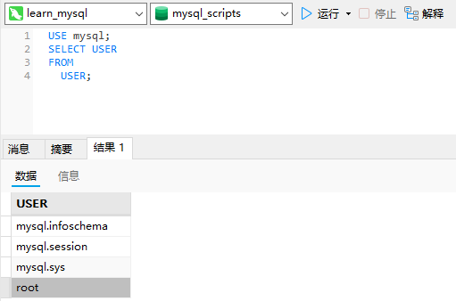

# 28_安全管理

## 访问控制

MySQL服务器的安全基础是：用户应该对他们需要的数据具有适当的访问权，既不能多也不能少。

## 管理用户

MySQL用户账号和信息存储在名为mysql的MySQL数据库中。

需要直接访问它的时机之一是在需要获得所有用户账号列表时。

```sql
USE mysql;
SELECT USER 
FROM
  USER;
```



### 创建用户账号

为了创建一个新用户账号，使用`CREATE USER`语句。

```sql
CREATE USER ben IDENTIFIED BY 'p@$$w0rd';
```

为重新命名一个用户账号，使用`RENAME USER`语句。

```sql
RENAME USER ben TO bforta;
```

### 删除用户账号

为了删除一个用户账号（以及相关的权限），使用`DROP USER`语句。

```sql
DROP USER bforta;
```

### 设置访问权限

新创建的用户账号没有访问权限。

为看到赋予用户账号的权限，使用`SHOW GRANTS FOR`。

```sql
SHOW GRANTS FOR bforta;
```

用户定义为user@host：MySQL的权限用用户名和主机名结合定义。如果不指定主机名，则使用默认的主机名%。

为设置权限，使用`GRANT`语句。`GRANT`要求你至少给出以下信息：

- 要授予的权限；
- 被授予访问权限的数据库或表；
- 用户名。

```sql
GRANT SELECT ON crashcourse.* TO beforta;
```

此`GRANT`允许用户在`crashcourse.*`（`crashcourse`数据库的所有表）上使用`SELECT`。

`SHOW GRANTS`反映这个更改：

```sql
SHOW GRANTS FOR bforta;
```

`GRANT`的反操作为`REVOKE`，用它来撤销特定的权限。

```sql
REVOKE SELECT ON crashcourse.* FROM beforta;
```

这条`REVOKE`语句取消刚赋予用户`bforta`的`SELECT`访问权限。被撤销的访问权限必须存在，否则会出错。

### 更改口令

为了更改用户口令，可使用`SET PASSWORD`语句。新口令必须传递到Password()函数进行加密。

```sql
SET PASSWORD FOR bforta = Password('n3w p@$$w0rd');
```

```sql
SET PASSWORD = Password('n3w p@$$w0rd');
```

在不指定用户名时，`SET PASSWORD`更新当前登录用户的口令。