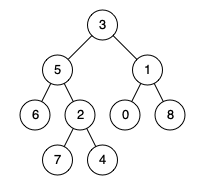

# [236_二叉树的最近公共祖先](https://leetcode.cn/problems/lowest-common-ancestor-of-a-binary-tree/)

难度：中等

## 问题描述：

给定一个二叉树, 找到该树中两个指定节点的最近公共祖先。

[百度百科](https://baike.baidu.com/item/最近公共祖先/8918834?fr=aladdin)中最近公共祖先的定义为：“对于有根树 T 的两个节点 p、q，最近公共祖先表示为一个节点 x，满足 x 是 p、q 的祖先且 x 的深度尽可能大（**一个节点也可以是它自己的祖先**）。”

**示例 1：**


```java
输入：root = [3,5,1,6,2,0,8,null,null,7,4], p = 5, q = 1
输出：3
解释：节点 5 和节点 1 的最近公共祖先是节点 3 。
```

**示例 2：**



```java
输入：root = [3,5,1,6,2,0,8,null,null,7,4], p = 5, q = 4
输出：5
解释：节点 5 和节点 4 的最近公共祖先是节点 5 。因为根据定义最近公共祖先节点可以为节点本身。
```

**示例 3：**

```java
输入：root = [1,2], p = 1, q = 2
输出：1
```

## 解题思路：


## Java代码：

```java
/**
 * Definition for a binary tree node.
 * public class TreeNode {
 *     int val;
 *     TreeNode left;
 *     TreeNode right;
 *     TreeNode(int x) { val = x; }
 * }
 */
class Solution {
    /**
     * 寻找二叉树中两个节点的最近公共祖先
     * @param root 二叉树的根节点
     * @param p 第一个节点
     * @param q 第二个节点
     * @return 最近公共祖先节点
     */
    public TreeNode lowestCommonAncestor(TreeNode root, TreeNode p, TreeNode q) {
        // 基本情况：如果树为空，或者找到了p或q，返回当前节点
        if (root == null || root == p || root == q) {
            return root;
        }
        
        // 递归搜索左子树
        TreeNode left = lowestCommonAncestor(root.left, p, q);
        
        // 递归搜索右子树
        TreeNode right = lowestCommonAncestor(root.right, p, q);
        
        // 如果左右子树的结果都不为null，说明p和q分别在左右子树中，
        // 当前root就是它们的最近公共祖先
        if (left != null && right != null) {
            return root;
        }
        
        // 如果左子树结果为null，返回右子树的结果
        // 如果右子树结果为null，返回左子树的结果
        // 如果两者都为null，则返回null
        return left != null ? left : right;
    }
}
```

